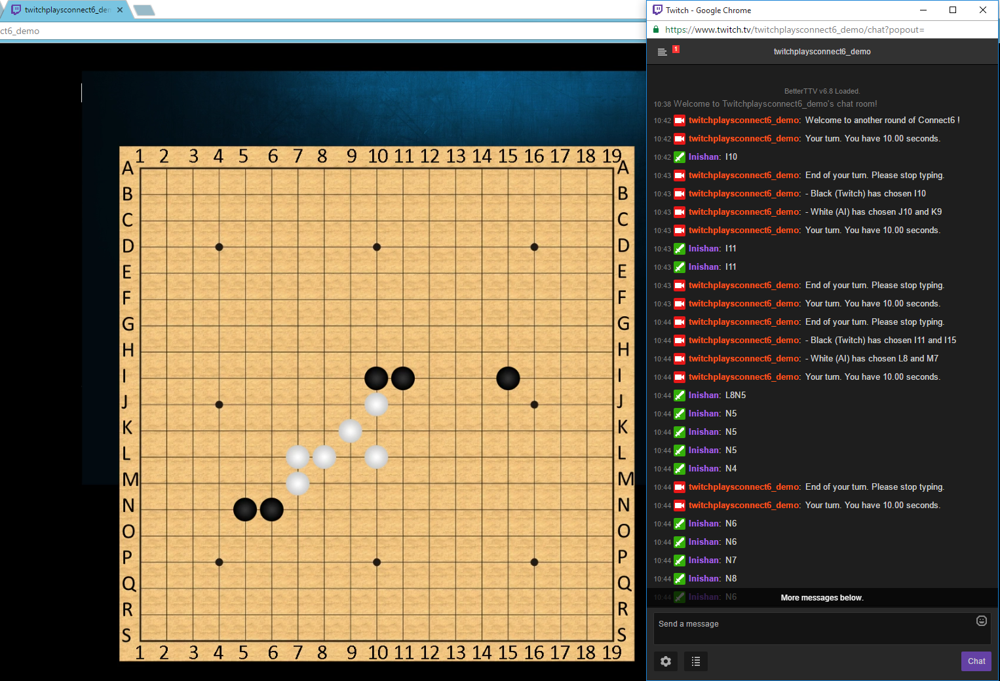

#TwitchPlaysConnect6

An **audience-sourced** [*Connect6*](https://en.wikipedia.org/wiki/Connect6) game hosted on [*TwitchTV*](https://www.twitch.tv/).

## Components

1. [FingRRR](https://github.com/lnishan/FingRRR), a multi-threaded interaction framework built on top of OpenCV.  
2. [TwitchPlaysAPI](https://github.com/lnishan/TwitchPlaysAPI), essentially an IRC bot that communicates with TwitchTV's IRC servers.  
3. [MyConnectAI](TwitchPlaysConnect6/myConnectAI.cpp), a Minimax-similar Connect6 AI I designed from scratch.

## Dependencies

- [Visual Studio 2015](https://www.visualstudio.com/)
- [Pthreads-win32](https://www.sourceware.org/pthreads-win32/)
- [OpenCV 3](http://opencv.org/)

## Technical Details

- [TwitchPlaysConnect6](https://github.com/lnishan/TwitchPlaysConnect6): [**Slide**](assets/TwitchPlaysConnect6_Slide.pdf) | [**Report**](assets/TwitchPlaysConnect6_Report.pdf)
- [FingRRR](https://github.com/lnishan/FingRRR): [**Slide**](assets/FingRRR_Slide.pdf) | [**Report**](assets/FingRRR_Report.pdf)
